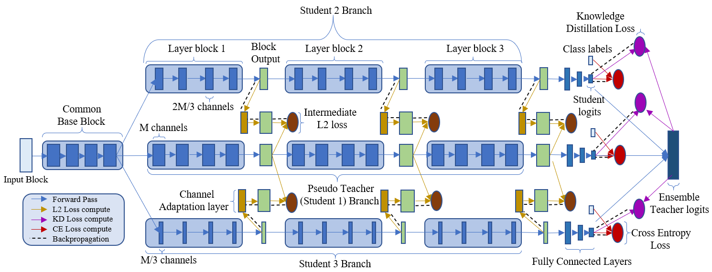

# Online Ensemble Model Compression using Knowledge Distillation 

This is the official repository for ECCV2020 Paper: Online Ensemble Model Compression using Knowledge Distillation [[Link](https://Devwalkar.github.io/PrePrints/OEC_KD.pdf)]. This work presents a novel knowledge  distillation based model compression framework consisting of a student ensemble. It enables distillation of simultaneously learnt ensemble knowledge onto each of the compressed student models.



## Requirements

- Pytorch >= 1.4
- Torchvision >= 0.5.0
- Numpy >= 1.18.1
- Matplotlib >= 3.2.0
- Pillow >= 7.0.0
- Pandas >= 1.0.0
- Six >= 1.14.0
- Lmdb >= 0.98
- Msgpack >= 1.0.0
- Tqdm >= 4.43.0
- Pyarrow >= 0.16.0
- Seaborn >= 0.10.0
- Pycaffe >= 1.0


## Ensemble Training

### Train from scratch

- In order to run the ensemble training framework using the available models, please create a specific config file using the `configs/config_template.py`. Modify the mentioned Architecture settings, Dataset and Training settings are per your requirement.  
- Be sure to set `Single_model_mode` as None for ensemble based training as this mode is meant to train a single baseline student model using the configured Dataset and training settings.  
- After setting up the config file as per requirements, suppose say `config_trial.py` run the following command from the repository root to start the ensemble training

```
cd tools && python3 train.py --cfg=configs/config_trial.py
```

### Resume training

- In order to resume a partially trained ensemble, set `Train_resume` as `True` and set in the respective experiment run id in `Load_run_id`. Further, set the `Load_Epoch` to the required training epoch after which to resume training.

## Individual Student Baseline Training

- In order to run a single compressed student for a baseline independent run using only the cross entropy loss, set `Single_model_mode` with the desired student number.  
- Please cross check that this number is lower than the total number of students present in the ensemble. Its corresponding field would be `No_students` under model settings in the config file.

## Contributor

- Devesh Walawalkar 
